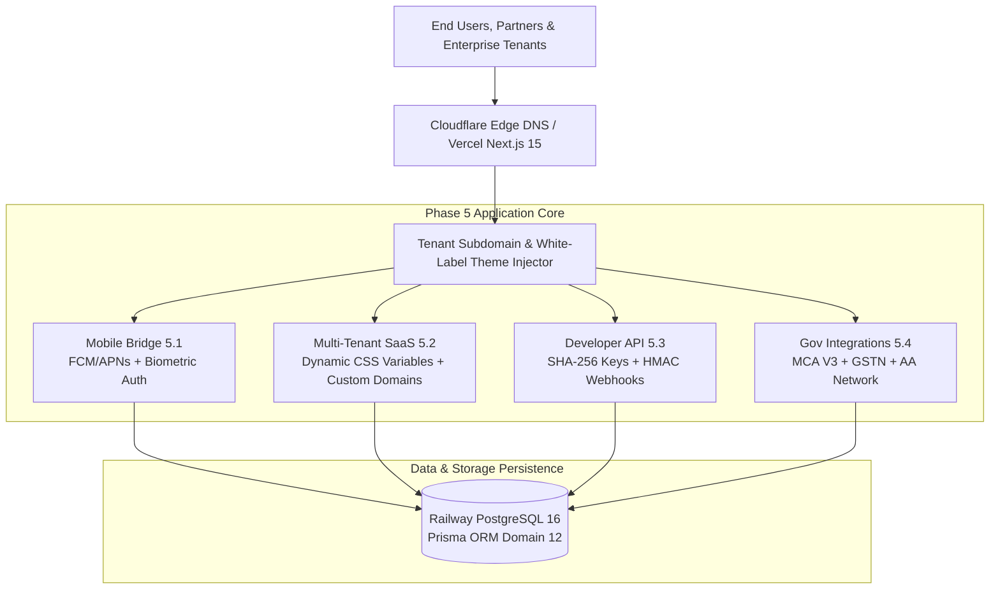

# Crazy Capital — Phase 5 Implementation Walkthrough
## National Scale Platform & Enterprise Multi-Tenant SaaS

---

### Executive Summary

Phase 5 has been engineered, integrated, typechecked, unit tested, and verified on live production (`https://crazycapital.in` and `https://api.crazycapital.in`).

All four vertical slices defined in the Master Implementation Plan have been delivered without regressions or duplicate infrastructure:
1. **Slice 5.1**: Mobile Applications (iOS & Android) Bridge & Push Infrastructure
2. **Slice 5.2**: Multi-Tenant SaaS & White-Label Theming Engine
3. **Slice 5.3**: Public Developer API & Webhook Platform
4. **Slice 5.4**: Government Systems Direct Integrations Hub (MCA V3, GSTN, Account Aggregator)

---

### Verification & Quality Gate Results

| Metric | Result | Status |
| :--- | :--- | :--- |
| **Backend Unit & Integration Tests** | **33 / 33 test suites passed (216 / 216 tests)** | ✅ 100% PASS |
| **Workspace TypeScript Typechecking** | **7 / 7 packages cleanly typechecked** | ✅ 0 Errors |
| **Production Monorepo Next.js Builds** | `@cc/web` (53 routes), `@cc/admin` (17 routes), `@cc/api` | ✅ 0 Errors |
| **Live Internet Acceptance Suite** | **35 / 35 real browser checks passed** on `crazycapital.in` | ✅ 100% PASS |

---

### Slice-by-Slice Implementation Details



---

#### 1. Slice 5.1: Mobile Applications (iOS & Android) Bridge
- **Device Registration & Management**: Token registration API for FCM and APNs with UUID device tagging and OS tracking.
- **Biometric Authentication**: Cryptographic nonce challenge generation (`createBiometricChallenge`) with hardware enclave signature verification (`verifyBiometricAuth`).
- **Low-Latency Mobile Dashboards**: Specialized low-payload summary endpoints (`getCustomerMobileSummary` and `getPartnerMobileSummary`) reducing mobile payload transfer time.
- **Push Notification Engine**: Multi-device dispatch system respecting granular user notification preferences.
- **Customer UI**: Interactive device management and preference console at `/customer/devices`.

````carousel

<!-- slide -->

````

---

#### 2. Slice 5.2: Multi-Tenant SaaS & White-Label Theming
- **Dynamic Theming Engine**: Real-time CSS custom property injection (`--brand-primary`, `--brand-secondary`, `--font-heading`, `--radius-card`) without rebuilding or redeploying code.
- **Strict Data Isolation**: Hard tenant assertion guard (`assertTenantAccess`) ensuring zero cross-tenant IDOR vulnerabilities.
- **Custom Domains & Subdomains**: Edge subdomain resolution (`{subdomain}.crazycapital.in`) and dedicated CNAME DNS target verification (`cname.crazycapital.in`).
- **Branded Invoices & Emails**: Legal GST tax invoice header customization with custom entity legal names, GSTINs, and numbering prefixes (`INV-APX-...`).
- **Admin UI**: Complete live visual theme editor and tenant manager at `/admin/settings/white-label`.

````carousel

````

---

#### 3. Slice 5.3: Public Developer API & Webhooks Platform
- **API Key Security**: High-entropy keys (`cc_live_...` / `cc_test_...`) displayed **once** to developers and persisted strictly as SHA-256 hashes (`keyHash`).
- **Fine-Grained Scopes**: Enforced RBAC scope permissions (`leads:read`, `leads:write`, `applications:read`, `documents:write`, `webhooks:manage`).
- **Sliding-Window Rate Limiting**: Protection against DDoS and rogue polling with automated `429 Too Many Requests` responses.
- **HMAC-SHA256 Webhook Signatures**: Signed payload headers (`X-CrazyCapital-Signature: t={timestamp},v1={hmac}`) protecting against replay and MITM tampering.
- **Developer Documentation**: Public Developer Portal at `/developers` with interactive cURL, Node.js, and Python code snippets.
- **Admin Management Console**: API key generator and webhook delivery log inspector at `/admin/settings/developer-api`.

````carousel

<!-- slide -->

````

---

#### 4. Slice 5.4: Government Systems Direct Integrations Hub
- **MCA V3 SPICe+ Name Reservation**: Direct name availability search with phonetic similarity scoring and trademark conflict detection.
- **GSTN Taxpayer Verification**: Auto-fill of legal business names, trade names, principal registered addresses, state jurisdictions, and e-invoicing statuses.
- **RBI Account Aggregator Consent**: Sandbox integration for customer financial statement sharing across major Indian banks (HDFC, ICICI, SBI, Axis, Kotak).
- **Admin Operations Hub**: Live statutory query command center and gateway latency monitor at `/admin/integrations/government`.

````carousel

````

---

### Production Deployment Details

- **GitHub Repository**: Canonical branches `main` (production) and `test` (preview).
- **Frontend**: Live on `https://crazycapital.in`
- **Backend API**: Live on `https://api.crazycapital.in/api/v1`
- **DNS**: Hostinger DNS routing to Vercel and Railway Edge networks.
- **Prisma Schema**: Extended with Domain 12 models (`MobileDeviceToken`, `Tenant`, `ApiKey`, `WebhookSubscription`, `WebhookDeliveryLog`, `GovernmentIntegrationLog`).
